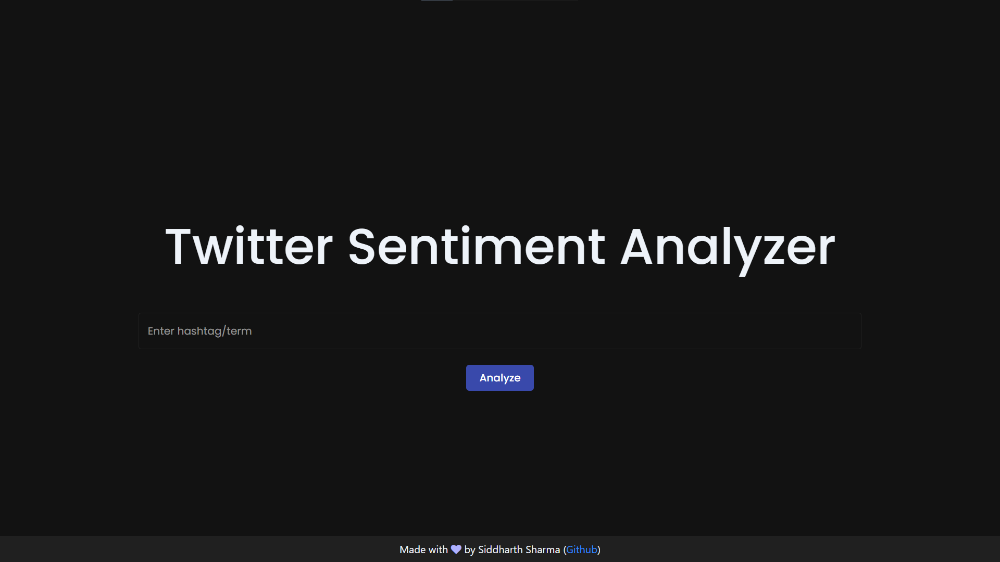
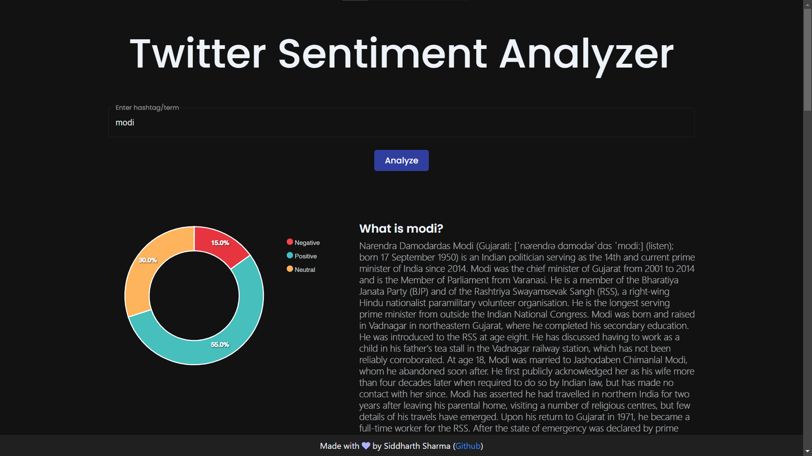
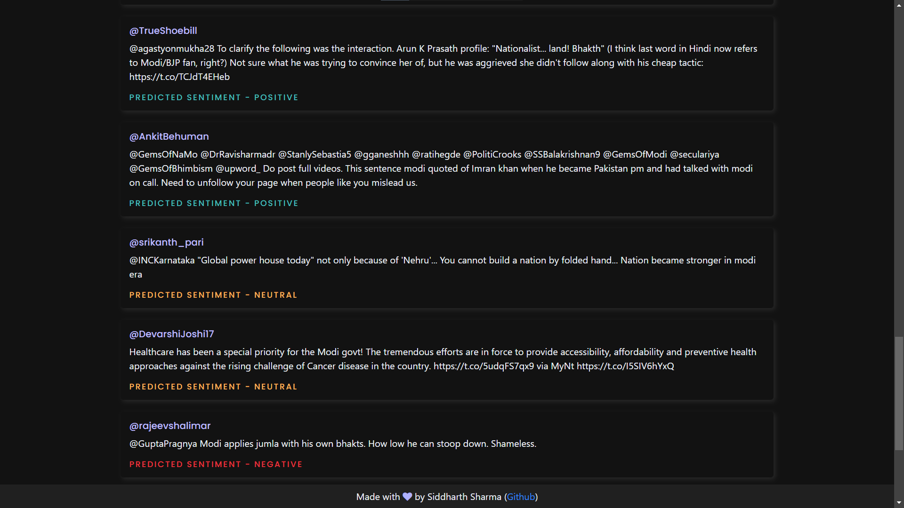
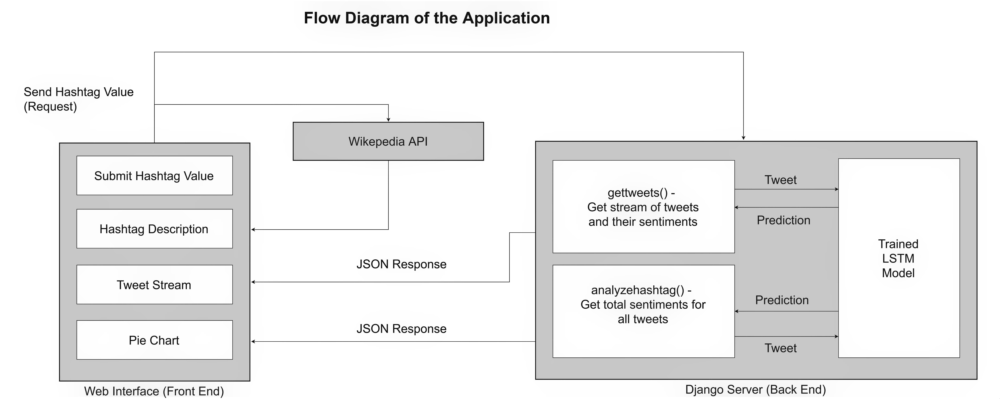

# Twitter Sentiment Analysis

## Preview

## Description
To assess user sentiment across Twitter hashtags and phrases, utilise this online application. It was developed using the React and Django frameworks, and it makes use of an LSTM model that was trained on the [Kaggle Sentiment140 dataset](https://www.kaggle.com/kazanova/sentiment140) and used as a REST API by the ReactJS front end.

Using **tweepy** and Keras, the service retrieves tweets and conducts inference. Additionally, based on the hashtag chosen to display a brief explanation, data is retrieved from the **Wikipedia API**. I included a few instances of the tweets and their anticipated attitudes as part of the research. You may find a kernel for a different sentiment categorization utilising a CNN + 1D pooling [here](https://www.kaggle.com/thatawkwardguy/twitter-sentiment-classification-using-cnns).

## Installation

### Setup

1. Download the [trained model](https://drive.google.com/file/d/1ckK5m4JysFKtBuC9yCnEaHe6cxOgXlG8/view?usp=sharing) and put into the `server/main` folder  (**Note:** _This is the CNN model. If you want use the LSTM model, you'll need to follow the [training steps](#training-the-model) below and put the saved model in `server/main`. Also, don't forget to change the loaded model name in `server/main/__init__.py`_ )

2. Obtain Twitter API credentials through Keys and Tokens tab under the [Twitter Developer Portal Projects & Apps page](https://developer.twitter.com/en/portal/projects-and-apps) and add them to the `/server/main/config.py` file.  
(**Note:** _Please obtain an "Elevated" account because this tweepy auth operates on Twitter API v1.1 endpoint. Standard Developer account forbids these calls_)

3. Run `docker-compose up --build` in the terminal from the root folder   (**Note:** _Ensure that you have Docker installed_)

### Run

1. Open `http://localhost:3000` in your browser to access the app

### Training

_(Note: The LSTM model takes long to train due to its sequential nature, and offer relatively similar performance)_

#### LSTM Model

1. Download the [Kaggle Sentiment140 dataset](https://www.kaggle.com/kazanova/sentiment140) and put it in the root folder as `sentiment140.csv`.
2. Run the code blocks given in the `training.ipynb`
